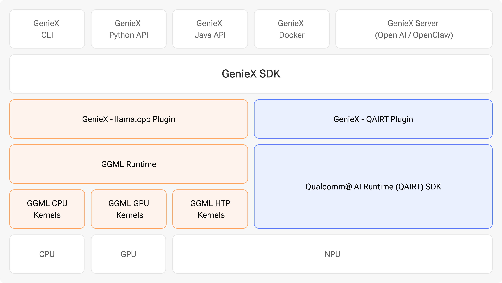

<div align="center">

<picture>
  <source media="(prefers-color-scheme: dark)" srcset="GenieX-Logo-Hor-1-White.png" />
  <source media="(prefers-color-scheme: light)" srcset="GenieX-Logo-Hor-1-Black.png" />
  
</picture>

### The easiest way to run frontier LLMs & VLMs locally on Qualcomm devices

[](https://geniex.aihub.qualcomm.com)
[](https://github.com/qualcomm/GenieX/releases)
[](LICENSE)
[](https://aihub.qualcomm.com/community/slack)

[**Documentation**](https://geniex.aihub.qualcomm.com) · [**Quickstart**](#quickstart) · [**Models**](#models) · [**Community**](#-community--contact)

</div>

---

GenieX is an **on-device Gen AI inference runtime for Qualcomm devices**. Bring  almost any GGUF model from Hugging Face — or a pre-compiled bundle from [Qualcomm AI Hub](https://aihub.qualcomm.com/models/) — and run it locally on the **Hexagon NPU, Adreno GPU, or CPU** in a few lines of code. One C SDK underneath, exposed through a CLI, Python, Kotlin/Java, Docker, and an OpenAI-compatible server. It is the community version of Qualcomm GENIE.

<div align="center">
  
</div>

## Supported platforms

GenieX runs **only on Qualcomm Snapdragon**. Find your platform, then jump straight to the interface you want to use.

| Platform | Example devices | Jump to a quickstart |
| --- | --- | --- |
| 🪟 **Windows ARM64** *(Compute)* | Snapdragon X · X Elite | [CLI](#cli) · [Python](#python) · [Local server](#openai-compatible-server) |
| 🤖 **Android** *(Mobile)* | Snapdragon 8 Elite · 8 Elite Gen 5 | [Android SDK](#android-kotlin--java) |
| 🐧 **Linux ARM64** *(IoT)* | Dragonwing QCS9075 | [CLI](#cli) · [Docker](#docker) · [Python](#python) |


> No device on hand? Spin up a remote session on [Qualcomm Device Cloud](https://qdc.qualcomm.com/).

---

## Quickstart

Pick your interface below. Each one follows the same three steps — **Install**, **Run**, and **Docs** — and shows both runtimes: a **GGUF** model from Hugging Face (`llama_cpp`) and a **pre-compiled bundle** from Qualcomm AI Hub (`qairt`, NPU).

### CLI

 

**Install**

- **Windows ARM64** — [download the installer](https://github.com/qualcomm/GenieX/releases), run it, then open a new terminal.
- **Linux ARM64** — one line, no `sudo`:
  ```bash
  curl -fsSL https://qaihub-public-assets.s3.us-west-2.amazonaws.com/qai-hub-geniex/install.sh | sh
  ```

**Run** — chat with any model in one line (drag in an image for VLMs):

```bash
# GGUF from Hugging Face → llama.cpp (NPU / GPU / CPU)
geniex infer google/gemma-4-E4B-it-qat-q4_0-gguf

# Pre-compiled bundle from Qualcomm AI Hub → Qualcomm AI Engine Direct (NPU)
geniex infer ai-hub-models/Qwen2.5-VL-7B-Instruct
```

📖 **Docs** — [Install](https://geniex.aihub.qualcomm.com/en/run/cli/install) · [Quickstart](https://geniex.aihub.qualcomm.com/en/run/cli/quickstart) · [Command reference](https://geniex.aihub.qualcomm.com/en/run/cli/reference)

### Python

 

**Install**

```bash
pip install -i https://test.pypi.org/simple/ --extra-index-url https://pypi.org/simple geniex
```

**Run** — mirrors Hugging Face `transformers` (`from_pretrained()` → `.generate()`):

```python
# GGUF from Hugging Face → llama.cpp
from geniex import AutoModelForCausalLM

model = AutoModelForCausalLM.from_pretrained("unsloth/Qwen3.5-2B-GGUF", precision="Q4_0")

messages = [{"role": "user", "content": "What is 2+2?"}]
prompt = model.tokenizer.apply_chat_template(messages, add_generation_prompt=True)

for chunk in model.generate(prompt, max_new_tokens=256, stream=True):
    print(chunk, end="", flush=True)

model.close()
```

```python
# Pre-compiled bundle from Qualcomm AI Hub → Qualcomm AI Engine Direct (NPU)
from geniex import AutoModelForCausalLM

model = AutoModelForCausalLM.from_pretrained("ai-hub-models/Qwen3-4B")

messages = [{"role": "user", "content": "What is 2+2?"}]
prompt = model.tokenizer.apply_chat_template(messages, add_generation_prompt=True)

for chunk in model.generate(prompt, max_new_tokens=256, stream=True):
    print(chunk, end="", flush=True)

model.close()
```

📖 **Docs** — [Install](https://geniex.aihub.qualcomm.com/en/run/python/install) · [Quickstart](https://geniex.aihub.qualcomm.com/en/run/python/quickstart) · [API reference](https://geniex.aihub.qualcomm.com/en/run/python/api-reference)

### OpenAI-compatible server

 

**Install** — ships with the CLI ([install above](#cli)).

**Run** — pull any model (GGUF or Qualcomm AI Hub bundle), then serve an OpenAI-compatible API:

```bash
geniex pull ai-hub-models/Qwen3-4B-Instruct-2507
geniex serve   # serves http://127.0.0.1:18181/v1
```

```bash
curl http://127.0.0.1:18181/v1/chat/completions \
  -H "Content-Type: application/json" \
  -d '{
    "model": "ai-hub-models/Qwen3-4B-Instruct-2507",
    "messages": [{"role": "user", "content": "Hello!"}]
  }'
```

Point any OpenAI client at `http://127.0.0.1:18181/v1` — no code changes.

📖 **Docs** — [Local server guide](https://geniex.aihub.qualcomm.com/en/run/cli/local-server)

### Android (Kotlin / Java)


**Install** — add the SDK to your app module's `build.gradle.kts`:

```kotlin
dependencies {
    implementation("com.qualcomm.qti:geniex-android:0.3.1")
}
```

**Run** — fastest path is the sample app (chat UI, model picker for GGUF + Qualcomm AI Hub bundles, VLM support):

The Android demo app lives in [`qualcomm/ai-hub-apps`](https://github.com/qualcomm/ai-hub-apps/blob/release/geniex_chat_android/README.md). Clone it, open the sample app in Android Studio, and hit **Run**.

📖 **Docs** — [Install](https://geniex.aihub.qualcomm.com/en/run/android/install) · [Quickstart](https://geniex.aihub.qualcomm.com/en/run/android/quickstart) · [API reference](https://geniex.aihub.qualcomm.com/en/run/android/api-reference)

### Docker


**Install**

```bash
docker pull docker.io/qualcomm/geniex:latest
```

**Run** — the container wraps the CLI, so `geniex infer …` works exactly as above.

📖 **Docs** — [Docker guide](https://geniex.aihub.qualcomm.com/en/run/linux/install)

### C / C++ SDK

  

**Install** — link against the single C header [`sdk/include/geniex.h`](sdk/include/geniex.h); every other interface is a thin wrapper over it.

📖 **Docs** — [sdk/README.md](sdk/README.md) · [notes/build.md](notes/build.md)

---

## Models

GenieX has two runtimes so you get **broad model coverage** *and* **peak Snapdragon performance** in one stack. Both LLMs and VLMs are supported.

| | **llama.cpp** (`llama_cpp`) | **Qualcomm AI Engine Direct** (`qairt`) |
| --- | --- | --- |
| **Get models from** | [Hugging Face](https://huggingface.co/models?library=gguf) (any GGUF) | [Qualcomm AI Hub](https://aihub.qualcomm.com/models/) (pre-compiled) |
| **Format** | GGUF | Per-chipset bundle |
| **Compute units** | NPU · GPU · CPU | NPU only |
| **Best for** | Bringing your own GGUF | Highest NPU performance |


> For llama.cpp, pick the **`Q4_0`** precision when prompted — it has the best Hexagon NPU support. See the [Models guide →](https://geniex.aihub.qualcomm.com/en/models/supported) for the full list, precisions, and how to run a local model.


## 🤝 Contributing

Contributions are welcome! Before opening a PR, please read **[CONTRIBUTING.md](CONTRIBUTING.md)** for branch naming, commit / PR title format, pre-commit checks, and the FFI-update rule for public SDK headers.

| | |
| --- | --- |
| 🏗️ **Build** the CLI, SDK, or Python bindings | [notes/build.md](notes/build.md) |
| ▶️ **Run** & select compute units / pull models | [notes/run.md](notes/run.md) |
| 🏷️ **Release** — SemVer tags, channels, HTP signing | [notes/release.md](notes/release.md) |
| 📚 **All developer docs** | [docs/README.md](docs/README.md) |


## 💬 Community & Contact

Questions, ideas, or want to show off what you built? Come say hi.

- 💬 [**Slack**](https://aihub.qualcomm.com/community/slack) — ask questions and chat with the community in real time.
- 🐛 [**GitHub Issues**](https://github.com/qualcomm/GenieX/issues) — report a bug or request a feature.
- 🔗 [**LinkedIn**](https://www.linkedin.com/company/qualcommaihub) — follow Qualcomm AI Hub for news and updates.

### Contributors

Thanks to everyone building GenieX 💙

<a href="https://github.com/qualcomm/GenieX/graphs/contributors">
  
</a>

---

## 📄 License

BSD 3-Clause — see [LICENSE](LICENSE) and [NOTICE](NOTICE).

Use of this project is also subject to Qualcomm's [Terms of Use](https://www.qualcomm.com/site/terms-of-use).
