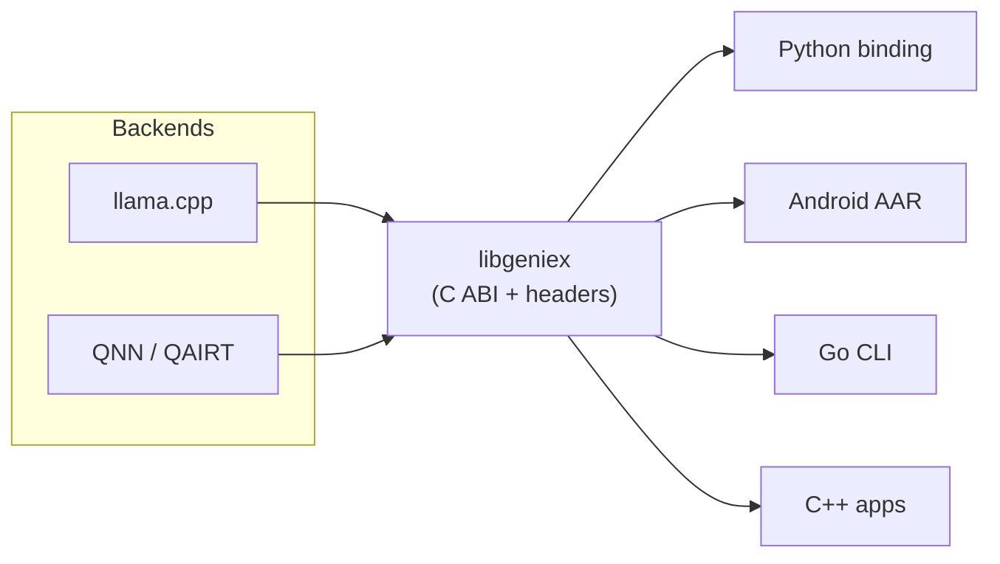

# GenieX SDK

The native core of GenieX: a unified C ABI ([`include/geniex.h`](include/geniex.h))
that runs LLMs and VLMs across multiple inference backends on Qualcomm
platforms (Windows ARM64, Linux ARM64, Android). Backends load as **dynamic
plugins**, so a build links only the engines it needs. The Go CLI, Python, and
Android bindings are all thin wrappers over this one library.

## Backends

| Plugin      | Engine               | Compute units                 | Model format |
|-------------|----------------------|-------------------------------|--------------|
| `llama_cpp` | llama.cpp / ggml     | CPU, Adreno GPU, Hexagon NPU  | GGUF         |
| `qairt`     | Qualcomm QNN / QAIRT | Hexagon NPU                   | QAIRT `.bin` |

Both target the NPU but through separate user-space stacks consuming different
model formats — they are not substitutes. See the top-level
[README § Runtimes & compute units](../README.md#runtimes--compute-units).

## Layout

| Path                                   | Contents                                                        |
|----------------------------------------|-----------------------------------------------------------------|
| [`include/`](include/)                 | Public C ABI (`geniex.h`) and plugin interfaces (`plugin/`).    |
| [`src/`](src/)                         | Core library — device resolution, LLM/VLM, registry, logging.   |
| [`plugins/`](plugins/)                 | Backend plugins: `llama_cpp`, `qairt`.                          |
| [`model-manager/`](model-manager/)     | Rust model puller / cache shared by the CLI and bindings.       |
| [`tests/benchmark/`](tests/benchmark/) | C inference benchmark driving the public API.                   |

Compute-unit alias resolution (`cpu` / `gpu` / `npu` / `hybrid`) lives in
[`src/device.cpp`](src/device.cpp) (`geniex_resolve_device`) — the single source
of truth for every binding. See [notes/run.md § Compute-unit aliases](../notes/run.md#compute-unit-aliases).

## Build

See [notes/build.md § Build the SDK](../notes/build.md#build-the-sdk) for the
per-platform CMake recipes. After `cmake --install`, the libs and headers land
in `pkg-geniex/`, which the bindings and CLI consume.

## Bindings

| Binding | Docs                                                        |
|---------|-------------------------------------------------------------|
| Python  | [bindings/python/README.md](../bindings/python/README.md)   |
| Android | [bindings/android/README.md](../bindings/android/README.md) |

  
By Qualcomm

